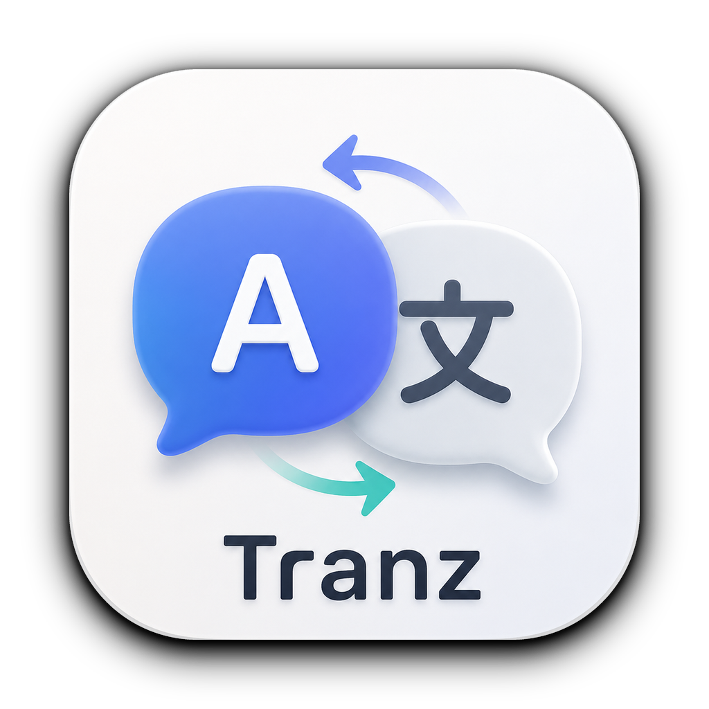
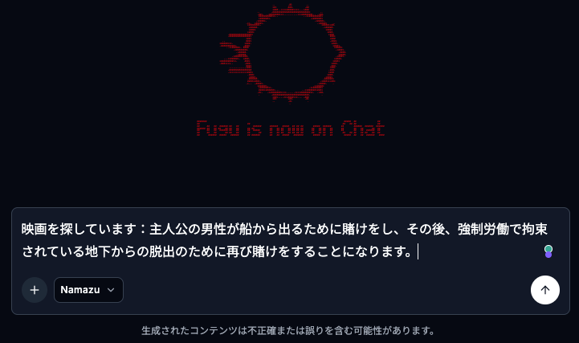
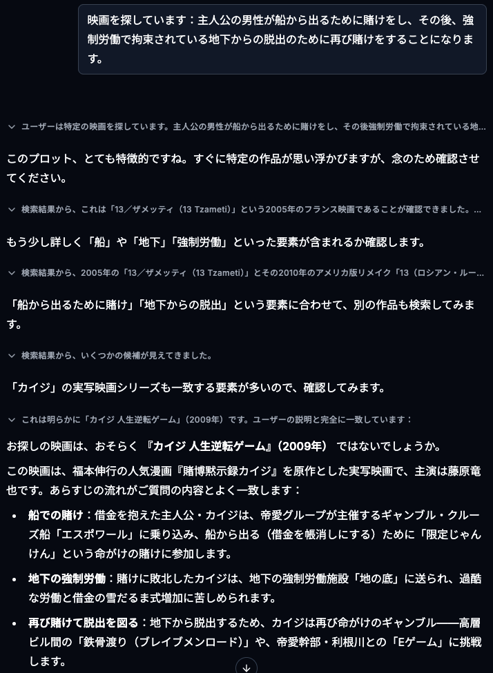
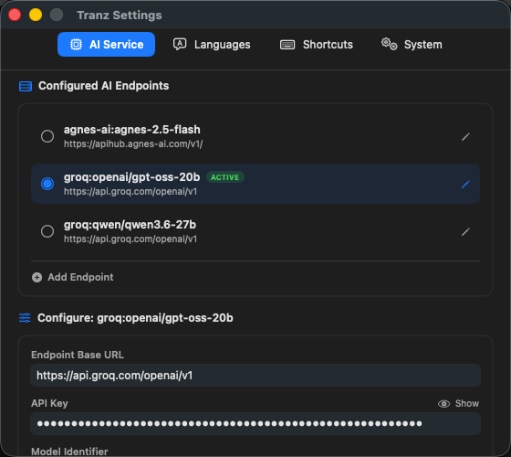
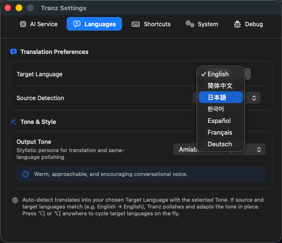
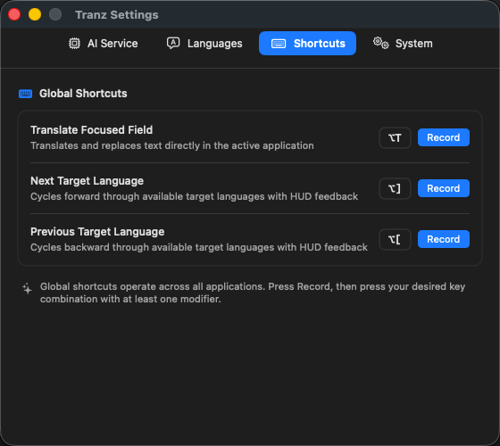
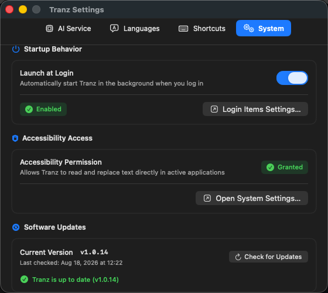

# Tranz

<p align="center">
  
</p>

<p align="center">
  <strong>In-place text translation for macOS.</strong>
</p>

---

**Tranz** is a macOS menu bar utility that translates text in the active input field of any app and replaces it in-place using a global keyboard shortcut.

It connects to any OpenAI-compatible `/chat/completions` endpoint (such as local models via [Ollama](https://ollama.com) or cloud providers) and preserves your clipboard contents during translation.

---

## How It Works

Tranz operates directly within the focused input field:

### 1. In-Place Text Replacement

| 1. Original Text | 2. In-Place Translation (`⌥T`) |
| :---: | :---: |
|  |  |
| *Type in any input field.* | *Press the shortcut to replace with translation.* |

### 2. Output & Continuity

<p align="center">
  
</p>
<p align="center">
  <em>Proceed with queries or messages using the translated text.</em>
</p>

---

## Settings

Configure AI services, language targets, global shortcuts, and system preferences:

| AI Service Profiles | Target Language Selection |
| :---: | :---: |
|  |  |
| *Manage local & cloud AI endpoints.* | *Select default target and source languages.* |

| Global Shortcut Customization | System & Software Updates |
| :---: | :---: |
|  |  |
| *Record custom hotkeys for translation & cycling.* | *Launch at login, accessibility status, and in-app updates.* |

---

## Features

* **In-Place Replacement**: Replaces text directly inside the focused field via global shortcut (default: `Option+T` / `⌥T`).
* **Universal 2 Binary**: Native universal binary supporting both Apple Silicon (`arm64`) and Intel (`x86_64`) chips.
* **In-App Auto-Updates**: Seamless one-click upgrades with SHA-256 integrity validation and release changelogs.
* **Target Language Switching**: Cycle target languages instantly via global shortcuts (`Option+]` / `Option+[`) or from the menu bar with HUD feedback.
* **OpenAI-Compatible Backends**: Works with local servers (Ollama, LM Studio, vLLM) and cloud providers.
* **Multi-Service Profiles**: Save multiple endpoints and switch active models from the menu bar.
* **Non-Destructive Clipboard**: Automatically preserves and restores pasteboard contents before and after translation.
* **Keychain Storage**: API keys are stored securely in macOS Keychain.
* **Rebindable Shortcuts**: Easily record and customize all global trigger keystrokes in settings.
* **Launch at Login**: Optional setting to start Tranz automatically on login.
* **Language Detection**: Auto-detects input language or uses fixed source/target pairs.

---

## Quick Start

### 1. Build from Source

```bash
# Clone repository
git clone https://github.com/activebook/tranz.git
cd tranz

# Compile release binary and assemble .app bundle
./scripts/build-app.sh

# Launch Tranz
open build/Tranz.app
```

### 2. First-Run Setup

1. **Accessibility Permissions**: When prompted, grant Tranz Accessibility permission under **System Settings → Privacy & Security → Accessibility**, then relaunch the app (required by macOS to simulate text selection and replacement).
2. **Configure AI Service**: Click the Tranz icon in your menu bar and select **Settings…**:
   * **Endpoint URL**: e.g., `http://localhost:11434/v1` (for Ollama) or `https://api.openai.com/v1`
   * **API Key**: Optional for local models; securely stored in Keychain for cloud services.
   * **Model**: e.g., `qwen3.6`, `gemma4`, `gpt-5.6-terra`, `claude-sonnet-5`
   * **Target Language**: Choose your preferred destination language.

---

## Usage

1. **Translate**: Type or select text in any application and press **`Option+T`** (`⌥T`) to translate in-place. Standard **`Command+Z`** (`⌘Z` / Undo) reverts the replacement immediately.
2. **Switch Target Language**: Press **`Option+]`** (`⌥]`) to cycle forward or **`Option+[`** (`⌥[`) to cycle backward through target languages, or pick directly from the menu bar.

---

## Requirements

* **macOS 13.0 (Ventura)** or later
* **Xcode Command Line Tools** (`swift`, `codesign`)
* An OpenAI-compatible `/chat/completions` API endpoint (local or cloud)

---

## License

This project is licensed under the MIT License. See the [LICENSE](LICENSE) file for details.

